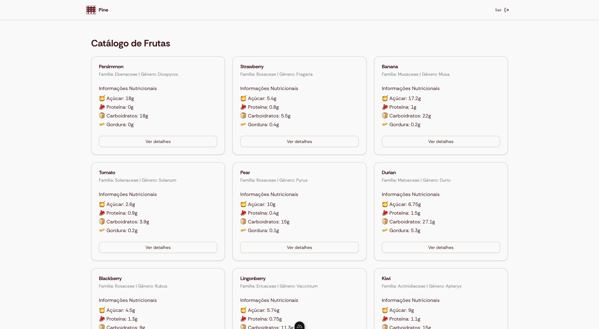

# Pine Dashboard

A study project exploring modern web development with Nuxt.js and shadcn-ui. Built as a fruit catalog system with detailed nutritional information to demonstrate authentication, dynamic routing.

<table>
  <tr>
    <td width="50%"></td>
    <td width="50%"></td>
  </tr>
</table>

## 🚀 Features

- 🔐 Authentication system with email validation
- 📱 Responsive design for all devices
- 📊 Detailed nutritional information display
- 🎨 Modern UI with shadcn components
- 🔄 Real-time data updates

## 🛠 Setup

1. Clone the repository:

```bash
git clone https://github.com/m7ez1n/nuxt-poc
```

2. Install dependencies:

```bash
# npm
npm install

# pnpm
pnpm install

# yarn
yarn install

# bun (recommended)
bun install
```

3. Start development server:

```bash
bun dev
```

The application will be available at `http://localhost:3000`

## 🏗 Build

```bash
# Build for production
bun build

# Preview production build
bun preview
```

## 🔧 Technologies

- **Framework**: [Nuxt.js 3](https://nuxt.com/) - Vue.js Framework
- **UI Components**: [shadcn-nuxt](https://www.shadcn-vue.com/) - Unstyled UI components
- **Styling**:
  - [Tailwind CSS](https://tailwindcss.com/)
  - [tailwindcss-animate](https://github.com/jamiebuilds/tailwindcss-animate)
- **Form Handling**:
  - [vee-validate](https://vee-validate.logaretm.com/)
  - [zod](https://github.com/colinhacks/zod)
- **Icons**: [lucide-vue-next](https://lucide.dev/)
- **Utilities**:
  - [@vueuse/core](https://vueuse.org/)
  - [class-variance-authority](https://cva.style/)
  - [clsx](https://github.com/lukeed/clsx)

## 📝 License

MIT
